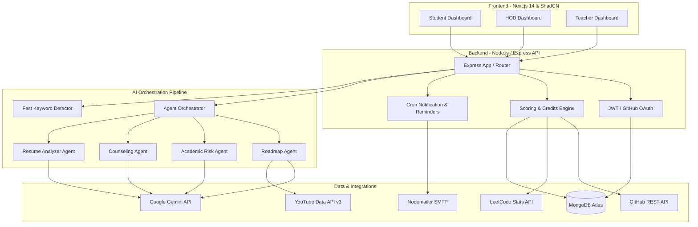

# 🧠 GSC Hassan AI-Powered Student Portal
### AI-Based Personalized Recommendation & Student Performance Analysis System
> **One-Line Pitch:** "Our system uses multi-agent AI to personalize learning, analyze academic risks, and evaluate students based on real-world skills, not just marks."

---

## 🗺️ 1. Project Overview & Vision

In traditional educational institutions, evaluations are heavily skewed toward CGPA and written examinations. Critical indicators of real-world readiness—such as coding consistency, practical projects, technical certifications, and technical skill acquisition—are often left unmonitored. 

This platform bridges the gap between academic evaluation and real-world skill development for **Government Science College Hassan (GSC Hassan)**. By integrating a multi-agent AI pipeline with student databases, GitHub, LeetCode, and custom resume parsing, the system provides:
1. **Personalized Learning Roadmaps:** 4-week tailored paths mapped to career goals with automated video resource curation.
2. **Academic Risk Monitoring:** Proactive alerts on attendance and mark shortfalls coupled with actionable AI-guided counseling.
3. **Holistic Skill Evaluation:** A live grading and credit system evaluating students out of 100 on coding activity, project execution, problem-solving, and learning consistency.
4. **Institutional Oversight:** HOD and Teacher dashboards featuring real-time department analytics, class-wide growth monitoring, performance leaderboards, and direct broadcast centers.

---

## 🏗️ 2. High-Level System Architecture

The platform operates on a robust full-stack architecture leveraging modern UI, highly responsive APIs, automated cron services, and the **Google Gemini API** for intelligence orchestration.



---

## 🧰 3. Technology Stack

| Technology Layer | Tool / Library Used | Purpose |
| :--- | :--- | :--- |
| **Frontend Framework** | Next.js 14.2 (App Router) | High-performance React engine, Server-Side Rendering (SSR), file-based routing. |
| **Styling & Theme** | Tailwind CSS | Sleek, fast CSS processing with dynamic theme attributes. |
| **Component Library** | ShadCN UI + Lucide Icons | Custom-styled, premium dark-themed UI components for ultimate consistency. |
| **Client State** | Zustand | Light-weight, durable client-side state engine (persisting sessions). |
| **Client Validation** | Zod | Deep schemas ensuring forms are correctly input before transit. |
| **Interactive FX** | Custom WebGL Fragment Shaders | Sleek Geometric Blur Mesh in `geometric-blur-mesh.tsx` morphing between 8 wireframes. |
| **Backend Framework** | Node.js + Express.js (TypeScript) | Secure, high-throughput RESTful routing API layer. |
| **Database** | MongoDB Atlas (via Mongoose) | Scalable NoSQL store for profile, marks, roadmaps, and analytics. |
| **AI Processing** | Google Gemini API | Strategic engine driving multi-agent roadmaps, risk audits, and resumes. |
| **API Documentation** | Swagger UI (via `swagger-jsdoc`) | Live interactive visual route documentation and testing interface. |
| **External APIs** | YouTube Data API v3, GitHub REST API | Resource enrichment, commit fetching, repository sync. |
| **Automation & Jobs** | Node-Cron & Nodemailer SMTP | Automated roadmap nudges, weekly summaries, and email broadcasts. |

---

## 📂 4. Repository & File Structure

The project is structured under a clean, modular mono-repository architecture keeping the client and server code completely separate and highly maintainable:

```
clg-project/
├── Code_D-F/                 # FRONTEND ENGINE (Next.js 14 App Router)
│   ├── public/               # Static assets & illustrations
│   └── src/
│       ├── app/              # File-based routes & layout engines
│       │   ├── (auth)/       # Security flows (login, register, forgot-password, reset)
│       │   ├── (dashboard)/  # Main authenticated user templates
│       │   │   ├── ai/       # AI specialized interfaces (chat, resume builder)
│       │   │   ├── hod/      # HOD analytical views (alerts, rankings, management)
│       │   │   ├── student/  # Student portal (profile, progress, roadmaps, certificates)
│       │   │   └── teacher/  # Faculty analytical logs and insights
│       │   ├── layout.tsx    # Root layout configuration
│       │   └── page.tsx      # Main landing portal with WebGL reveal engine
│       ├── components/       # Component library
│       │   ├── ui/           # Atomic UI elements (ShadCN custom extensions)
│       │   └── shared/       # Cross-page compound elements
│       ├── lib/              # Core API clients, constants, and utilities
│       ├── stores/           # Session state management (Zustand)
│       └── validations/      # Zod validation structures
│
├── Code_D-B/                 # BACKEND SERVER (Node.js, Express, TypeScript)
│   ├── src/
│   │   ├── config/           # Database, mailers, and environment parameters
│   │   ├── controllers/      # Route handler implementations
│   │   │   ├── auth/         # Security operations & password recovery handlers
│   │   │   ├── student/      # Student-specific operations (resume, progress, scoring)
│   │   │   └── hod/          # High-level analytics and broadcasting controllers
│   │   ├── models/           # Mongoose schemas (User, Mark, Attendance, Roadmap)
│   │   ├── routes/           # Router endpoints grouping & middleware bindings
│   │   ├── services/         # Business logic layer
│   │   │   ├── ai/           # Multi-agent orchestrator, roadmaps, parsing APIs
│   │   │   └── email/        # Nodemailer notification templates & workers
│   │   ├── jobs/             # Scheduled background cron events
│   │   ├── middleware/       # JWT parsing, role audits, and security walls
│   │   └── utils/            # Shared loggers, string helpers, and Gemini bindings
│   └── tsconfig.json         # Strict TypeScript compile configurations
```

---

## 👥 5. Role-Based Feature Matrices

The platform implements strict role-based access control (RBAC) supporting three primary profiles: **Student**, **HOD (Head of Department)**, and **Teacher**.

### 🧑‍🎓 5.1 The Student Portal
* **Dashboard Overview:** Displays basic profile stats (CGPA, active branch, current year) paired with a live dynamic performance score (0 to 100) and letter grade (A-F).
* **Interactive AI Roadmaps:** Generates specialized, personalized roadmaps based on specified career goals, skipping topics the student already knows. Tasks are enriched with direct YouTube video guides.
* **Progress Tracking & Logs:** Students can mark weekly tasks as complete, which instantly updates their credit scoring metric and dashboard progress tracking bars.
* **Resume PDF Analyzer:** Students can upload their PDF resume. The system uses a document parsing service mapped to Gemini to extract skills, diagnose skill gaps for targeted roles, and provide a technical interview readiness score.
* **Certificate Analysis Portal:** Direct upload of certificates. An integrated computer vision and OCR prompt analyzes certificates to dynamically add verified credentials and award credits.
* **AI Mentorship Chatbot:** An online virtual counselor available 24/7. It provides academic guidance, suggests projects, and answers queries regarding complex topics.

### 🧑‍🏫 5.2 The HOD (Head of Department) Dashboard
* **Dynamic Student Directory:** A filterable view of all students in the branch, allowing detailed deep-dives into single-student activity profiles, roadmaps, and marks.
* **Academic & Performance Analytics:** Visual aggregate diagrams displaying grade distributions across semesters and tracking general student performance.
* **Global Rankings Leaderboard:** Highlights top performers dynamically calculated based on their real-world skill score (coding activity + projects + problem-solving + consistency).
* **At-Risk Alerts Panel:** Displays flags highlighting students who are struggling academically (due to low attendance or poor marks) or showing prolonged inactivity on their learning roadmaps.
* **Branch-Wide Broadcasts:** Allows the HOD to draft urgent announcements or updates (filtered by year) with a single-click email notification switch to instantly email affected students.

### 🧑‍🏫 5.3 The Teacher Dashboard
* **Class Performance Overviews:** A clean dashboard for faculty to view performance metrics across class batches and individual subjects.
* **Attendance & Marks Importer:** Supports standard CSV bulk uploads for student attendance records and internal marks to rapidly synchronize the MongoDB state.
* **Inactivity Monitoring Logs:** Enables teachers to monitor students who have abandoned active roadmaps, making it easy to schedule focused counseling sessions.

---

## 🤖 6. Deep Dive: The Multi-Agent AI Engine

The real intelligence of the system lives in `Code_D-B/src/services/ai/`, powered by the **Google Gemini API** (`gemini-1.5-pro` / `gemini-1.5-flash`). Rather than single-turn prompts, the system orchestrates multiple agent roles to manage complex scenarios.

### 🗺️ 6.1 Personalized Learning Roadmap Pipeline (`agentOrchestrator.ts`)
The system employs an optimized, parallelized design to deliver high-quality roadmaps without latency overhead:

1. **The Combined Architect & Strategist Agent:** A combined prompting scheme takes the student's career goal, active skills, branch, and current year to model a structured 4-week roadmap in pure, verified JSON:
   ```json
   [
     {
       "weekNumber": 1,
       "theme": "Introduction to UI Design Systems",
       "careerInsight": "Understanding grids and color theories is crucial for design consistency.",
       "tasks": [
         { "title": "Learn Figma Basics", "description": "Master component properties and auto-layouts." }
       ],
       "resources": ["Figma Docs", "Refactoring UI Book"]
     }
   ]
   ```
2. **YouTube Video Enrichment Worker:** Rather than making sequential queries (which would result in 12 sequential network requests for a 4-week roadmap), the orchestrator triggers parallel YouTube API queries using `Promise.allSettled`.
3. **Quota Fallback Logic:** If the YouTube search API reaches quota limits or encounters network issues, the orchestrator handles the rejection gracefully, leaving video items blank but successfully delivering the roadmap without crashing.

### 📊 6.2 The Academic Risk & Counseling Pipeline
An automated analytics system keeps tabs on student progression by chaining two specific agents:

```
[Attendance + Marks Data]
          │
          ▼
┌──────────────────┐
│    Risk Agent    │ ──► Diagnoses risk tier (LOW, MEDIUM, HIGH)
└──────────────────┘     Identifies specific subjects at risk
          │
          ▼ (Risk Output passed to next stage)
┌──────────────────┐
│ Counseling Agent │ ──► Formulates empathetic counseling messages
└──────────────────┘     Generates 3 actionable steps to recover
```

* **The Risk Agent:** Pulls the student's recent attendance entries and exam marks from MongoDB. It evaluates thresholds and outputs a structured diagnostic analysis (`riskLevel: 'HIGH' | 'MEDIUM' | 'LOW'`).
* **The Counseling Agent:** Employs the diagnostic output, cross-references it with the student's career goals and profile bio, and writes a highly supportive, personalized academic action plan with 3 realistic, step-by-step correction measures.

### 📄 6.3 Resume Analyzer Agent (`resumeAnalyzerService.ts`)
* Accepts plain-text extracted from uploaded resumes and matches it against a student-defined target career role (e.g., "SRE Engineer").
* Evaluates the resume out of 100.
* Identifies direct technical skill gaps (e.g., "Missing Docker experience for SRE role") and highlights existing key strengths.

---

## 📈 7. Holistic Student Evaluation & Scoring Logic

Rather than evaluating students strictly based on written exam scores, the platform calculates a **Live Skill Score (out of 100)** to grade students dynamically (A through F):

$$\text{Live Score} = (30\% \times \text{Coding Activities}) + (30\% \times \text{Project Execution}) + (20\% \times \text{Problem Solving}) + (20\% \times \text{Learning Consistency})$$

* **Coding Activities (30%):** Monitored through live GitHub REST integration, tracking commits, active contributions, pull requests, and repository counts.
* **Project Execution (30%):** Calculated based on verified, completed tasks marked on the learning roadmaps, supplemented by automated certificate verification.
* **Problem Solving (20%):** Tracked by querying LeetCode problem-solving endpoints to monitor the count and difficulty breakdown of solved coding questions.
* **Learning Consistency (20%):** Monitored through consecutive active days on the platform, routine progress logs, and timely completion of academic milestones.

---

## 🚀 8. Setup & Deployment Guidelines

Both the frontend and backend applications are configured for effortless scale and live synchronization:

* **Frontend Deploy:** Deployed to **Vercel** at `https://clg-project-pswn.vercel.app`. Features Next.js static optimizations, edge-cached styling bundles, and persistent secure cross-origin routing.
* **Backend Deploy:** Deployed to **Render** at `https://clg-project-i2j8.onrender.com`. Configured with automated zero-downtime health monitors.
* **Secure Environment Handshake:** The frontend communicates with the backend via the `NEXT_PUBLIC_API_URL` environment variable. All requests are managed by an Axios instance configured with `withCredentials: true` to handle secure session management using HTTP-Only cookies.

---

*Prepared for Government Science College Hassan (GSC Hassan) Student Portal System.*
